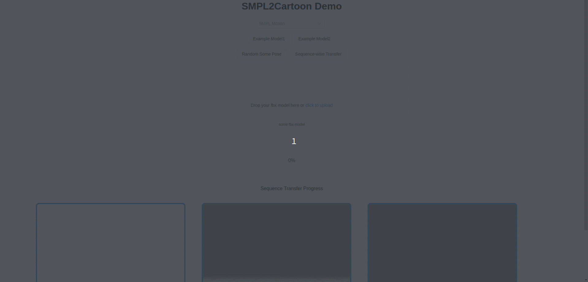

## SMPL2Cartoon 

Transfer body motion (in SMPL format,  24 x 3 body poses) to some cartoon models (fbx model) 

- front-end:  vue.js (vue3) + three.js 

- back-end:  python3, flask 


## [Web Demo](http://121.5.67.94/smpl2cartoon)




* There are three windows, showing SMPL motion sequences, preview of the FBX model,   animated (retargeted mesh of) the cartoon model 

* Two example fbx cartoon models are provided, also you can upload your own fbx cartoon model (**notice that the fbx parsing motion transfer can fail since it adopts a brute-force matching method**)

* Two transfer modes are provided:

  * Random Some Pose:   randomly sample some pose from the pose space of SMPL model and animate the cartoon model 
  * Sequence-wise Transfer:  Transfer the selected motion sequence (as you see in the first window) to the fbx model (when it's done, expect to see an almost synchronous cartoon model in the third window)

* Download

  * Parsed FBX model:   download the parsed mesh(.obj), rig information(txt) and materials (.mtl and some images)

  * Animated Sequence:   plus the meshes(.obj) of the whole sequence.

    

## Installation

`git clone https://github.com/FishWoWater/smpl2cartoon ~/`

### front-end 

```
# install nodejs and vue3 
# e.g sudo apt install nodejs && npm install vue@next

# node modules 
cd frontend && npm install

# configure the backend ip address (serverUrl) in `src/Components/CartoonView.vue`
# left as default for localhost debugging 

./deploy.sh 
```


### back-end 

```
# recommend python 3.7 or 3.8 
conda install -n smpl2cartoon python=3.7

# install requirements 
pip install flask flask_cors matplotlib 
pip install open3d==0.10.0   

# **install mayapy on your pc**
# follow instructurions here https://knowledge.autodesk.com/support/maya/learn-explore/caas/simplecontent/content/installing-maya-2022-ubuntu.html
# this is used to parse the fbx model 

# run the service
# configure the port and ip address in run.sh and app.py if needed
./run.sh 
```


## TODO

- [ ] support multiple formats of cartoon model (more than fbx)
- [ ] add SMPL motion estimation module from RGB videos based on *our work*
- [ ] shorten the model downloading time, use a more compact data structure (don't load obj from the server repeatedly)
- [ ] optimize the topology matching method between SMPL and cartoon models (perhaps consider some tree matching methods)


## Reference

* SMPL:  a widely used parametric model used to describe the shape and motion of human body ([paper](https://www.semanticscholar.org/paper/SMPL:-a-skinned-multi-person-linear-model-Loper-Mahmood/32d3048a4fe4becc7c4638afd05f2354b631cfca))
* [Our Previous Repo](https://github.com/yuzhenbo/pose2carton)
